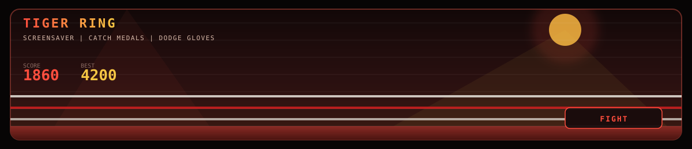

<p align="center">
  <a href="https://ahtem-tiger.github.io/Ahtem-tiger/">
    
  </a>
  <a href="https://ahtem-tiger.github.io/Ahtem-tiger/">
    
  </a>
</p>

<h1 align="center">Ahtem</h1>
<p align="center">
  <b>боец</b> · C++ и код с характером<br/>
  Ринг, дисциплина и чистый удар — в зале и в репозитории
</p>

<p align="center">
  <a href="https://ahtem-tiger.github.io/Ahtem-tiger/">
    
  </a>
  
  
  
</p>

---

### привет

Меня зовут **Ахтем**. Я боец: работаю в ринге, держу темп и не отпускаю раунд раньше гонга.

Параллельно пишу код — в основном **C++**. Тот же подход, что и в зале: техника, повтор, удар без лишнего шума.

<br/>

### стек

```text
ring       boxing · sparring · discipline
language   C++
tools      Git · GitHub
mode       fight first · then ship
```

<br/>

### проекты

| репозиторий | о чём |
|---|---|
| [Ahtem-lion](https://github.com/Ahtem-tiger/Ahtem-lion) | C++ практика |
| [Ahtem-tiger1](https://github.com/Ahtem-tiger/Ahtem-tiger1) | текущий эксперимент |
| [project](https://github.com/Ahtem-tiger/project) | учебный проект |

<br/>

### Tiger Ring

На заставке крутится ринг. Нажми баннер — и можно поиграть: лови медали, уворачивайся от перчаток. Стрелки или тап по сторонам экрана.

<p align="center">
  <a href="https://ahtem-tiger.github.io/Ahtem-tiger/"><b>открыть игру →</b></a>
</p>

<br/>

### статистика

<p align="center">
  
  
</p>

<p align="center">
  
</p>

---

<p align="center">
  <i>сначала бой — потом коммит</i><br/>
  <a href="https://github.com/Ahtem-tiger">github.com/Ahtem-tiger</a><br/>
  <sub>фото: Ilia Topuria, <a href="https://president.ge">president.ge</a>, <a href="https://creativecommons.org/licenses/by/4.0/">CC BY 4.0</a>, кадр изменён</sub>
</p>
